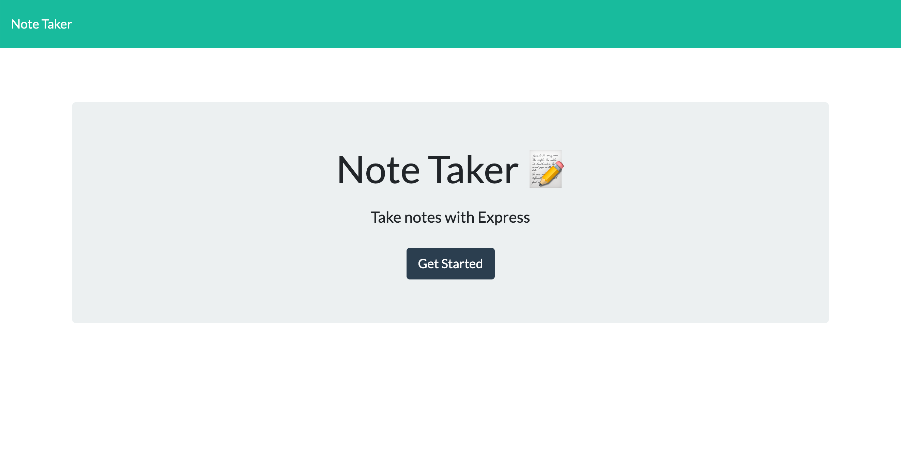
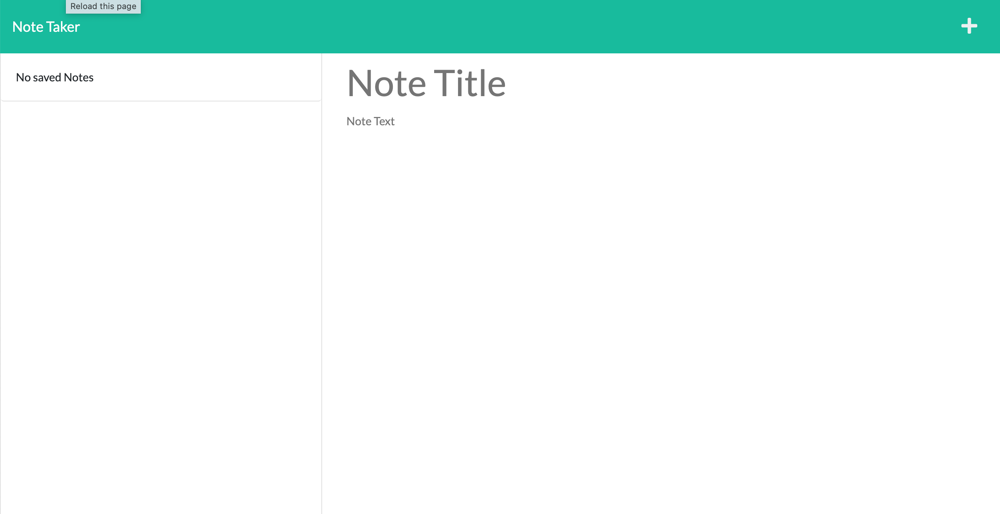
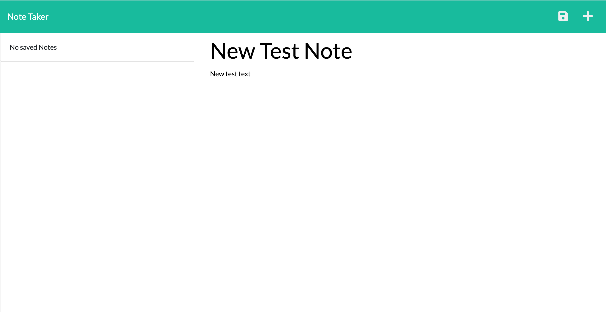
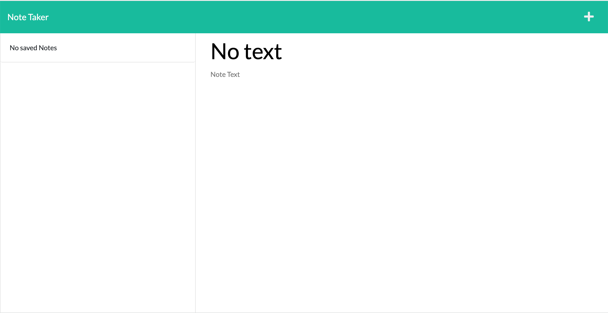
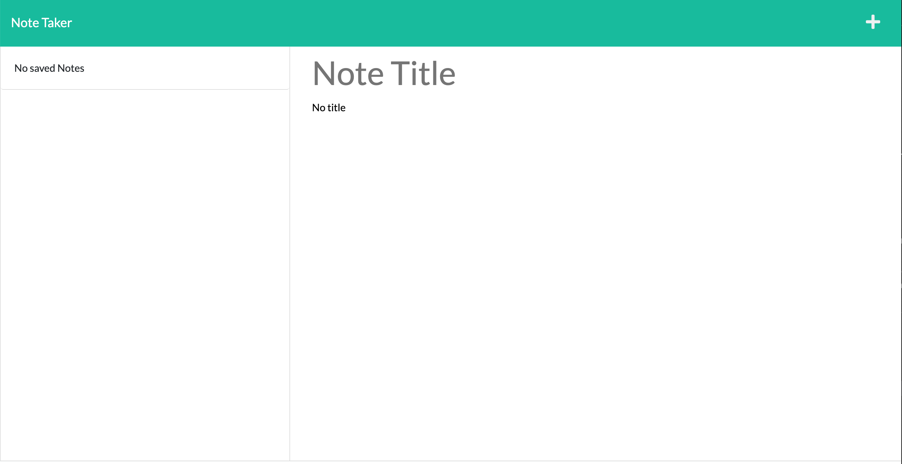
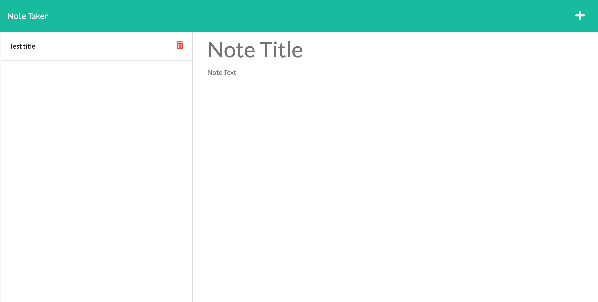
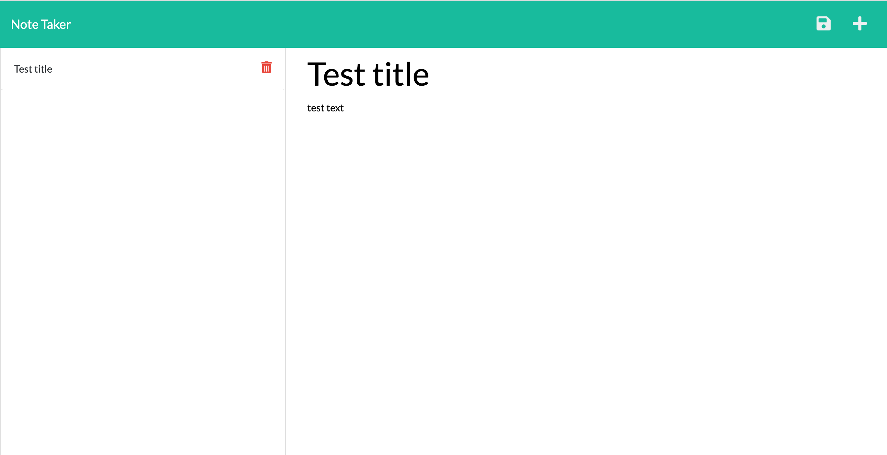
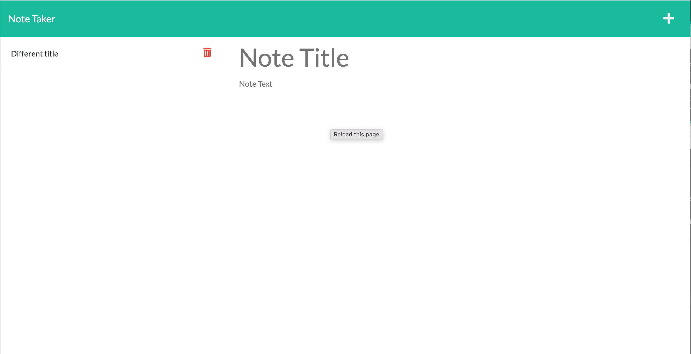

# Note Taker

## Description

Everyone from companies to individuals need a place to keep track of notes for projects, reminders, grocery lists, and everything in between. By using this, users have a safe place to store their notes. 

By building this project, I got to practice using Express.js for back-end development. I also learned a lot about Heroku deployment. I hope to be able to apply all of these skills in future.

## Table of Contents

- [Installation](#installation)
- [Usage](#usage)
- [Credits](#credits)
- [License](#license)
- [Badges](#badges)

## Installation

1. Click on green code button and copy the ssh link
2. Open up terminal or git bash, then navigate to where you want the repository to be placed.
3. Type out "git clone (ssh link)"
4. Be sure to install Node.js. Node.js is necessary to run this program. If you need to, download it from [Node.js website](https://nodejs.org/en/download/).
5. Once you have installed Node.js, navigate to inside the 'note-taker' folder
6. Run 'npm install' to install packages within package.json

## Usage

To run the program, navigate to your 'note-taker' folder and type 'node server.js' into the terminal. You can also use this note taking app by navigating to [my website](https://we-take-notes.herokuapp.com).

You will be greated by the home screen. 

To navigate to the notes page, click the 'Get Started' button. This will take you to a screen with a screen a left side filled with stored notes, and a right side with a blank note screen. If not notes are stored, the left side will state that the user has 'No saved Notes'.

To add notes, the you need to add both a title and text to the blank notes. This will allow a save button to appear in the top right corner.

If the title has no title or no text, you cannot save the note.

To save the note, click on the save button. This will allow the note to populate on the left side of the screen.

To see a saved note, click on it. This will cause it to reappear on the right side.

From this screen, you can edit the note and press the saved button to update it.

If you want to work with a new note instead, press the + in the top right corner. This will clear the screen giving you a new note to work with.

If you are using the local port and want to stop the program from running, press 'control + c'. This will quit the program in your terminal and the port will stop listening.

## Credits

Heroku installation: https://devcenter.heroku.com/articles/heroku-cli

Heroku app with specific name: https://devcenter.heroku.com/articles/git

fs.writeFile: https://www.geeksforgeeks.org/node-js-fs-writefile-method/ 

fs.readFile: https://www.geeksforgeeks.org/node-js-fs-readfile-method/

## License

Please refer to LICENSE in this repository 

## Badges

